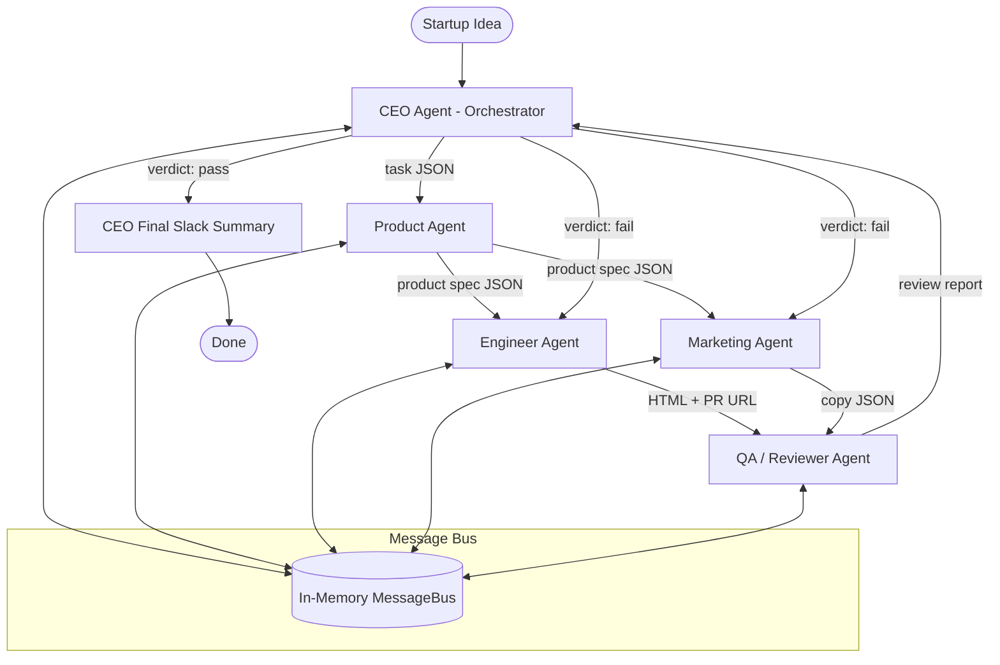

# LaunchMind ShiftSwap

A real Multi-Agent System (MAS) built with LangGraph that autonomously runs a micro-startup from idea to launch. Five LLM-powered agents collaborate to define, build, and market **ShiftSwap** -- a platform that helps hourly workers exchange shifts quickly and fairly, with manager approval and policy compliance.

## Startup Idea

**ShiftSwap** connects hourly workers who need to swap shifts with colleagues, ensuring manager approval and compliance with workplace policies. The platform targets retail, healthcare, and hospitality workers who currently rely on informal WhatsApp groups or bulletin boards to trade shifts -- a process that is slow, error-prone, and often violates scheduling rules.

## Agent Architecture



### Agent Roles

| Agent | Role | LLM Calls | Platform Actions |
|-------|------|-----------|-----------------|
| **CEO** | Orchestrator -- decomposes idea into tasks, reviews outputs, decides pass/fail | 2+ (decompose, review) | Posts final summary to Slack |
| **Product** | Product manager -- generates structured product spec | 1 | None (internal) |
| **Engineer** | Builder -- generates HTML landing page, pushes to GitHub | 2 (HTML, PR copy) | Creates GitHub branch, commit, issue, and PR |
| **Marketing** | Growth marketer -- generates copy, sends email, posts to Slack | 1 | Sends email via Brevo, posts to Slack with Block Kit |
| **QA** | Reviewer -- validates HTML and marketing copy | 2 (HTML review, marketing review) | Posts review comments on GitHub PR |

### Communication

All agents communicate via structured JSON messages through an in-memory `MessageBus`. Every message follows the schema:

```json
{
  "message_id": "uuid",
  "from_agent": "ceo",
  "to_agent": "product",
  "message_type": "task | result | revision_request | confirmation",
  "payload": {},
  "timestamp": "ISO 8601",
  "parent_message_id": "optional uuid"
}
```

### Dynamic Decision-Making (Feedback Loop)

The CEO agent reviews QA findings using LLM reasoning and can:
- **PASS**: proceed to post the final summary to Slack
- **FAIL**: send a `revision_request` to the responsible agent (engineer or marketing) with specific feedback, triggering a re-run of that agent followed by another QA cycle

Up to 3 revision cycles are supported before the pipeline auto-completes.

## Project Structure

```text
launchmind-shiftswap/
├── agents/
│   ├── __init__.py
│   ├── ceo_agent.py          # Orchestrator with decompose + review + final summary
│   ├── product_agent.py      # Product spec generation
│   ├── engineer_agent.py     # HTML generation + GitHub automation
│   ├── marketing_agent.py    # Copy generation + Brevo email + Slack posting
│   └── qa_agent.py           # LLM-based review + GitHub PR comments
├── utils/
│   ├── __init__.py
│   └── llm.py                # Shared OpenAI wrapper
├── main.py                   # Single entry point
├── graph.py                  # LangGraph workflow definition
├── config.py                 # Environment validation
├── message_bus.py             # In-memory message bus with full history
├── requirements.txt
├── .env.example               # Template for environment variables
├── .gitignore
└── README.md
```

## Setup Instructions

### Prerequisites
- Python 3.10+
- A GitHub account with a public repository
- A Slack workspace with a bot app
- A Brevo account (free tier)
- An OpenAI API key

### Steps

1. **Clone the repository**
   ```bash
   git clone https://github.com/ultimate144z/launchmind-shiftswap.git
   cd launchmind-shiftswap
   ```

2. **Create and activate a virtual environment**
   ```bash
   python -m venv venv
   source venv/bin/activate    # Linux/Mac
   venv\Scripts\activate       # Windows
   ```

3. **Install dependencies**
   ```bash
   pip install -r requirements.txt
   ```

4. **Configure environment variables**
   ```bash
   cp .env.example .env        # Linux/Mac
   copy .env.example .env      # Windows
   ```
   Edit `.env` and fill in your real API keys.

5. **Run the system**
   ```bash
   python main.py
   ```

## Platform Integrations

| Platform | What the agents do |
|----------|-------------------|
| **GitHub** | Engineer agent creates a branch, commits an AI-generated HTML landing page, opens an issue and a pull request. QA agent posts review comments on the PR. |
| **Slack** | Marketing agent posts a Block Kit formatted launch announcement to `#launches`. CEO agent posts a final pipeline summary. |
| **Brevo (Email)** | Marketing agent sends an LLM-generated cold outreach email to a test address via the Brevo transactional email API. |
| **OpenAI** | All agents use GPT-4o-mini for reasoning, content generation, and review. |

## Environment Variables

| Variable | Description |
|----------|-------------|
| `OPENAI_API_KEY` | OpenAI API key |
| `OPENAI_MODEL` | Model to use (default: `gpt-4o-mini`) |
| `GITHUB_TOKEN` | GitHub Personal Access Token (repo + workflow scopes) |
| `GITHUB_REPO` | GitHub repo in `owner/name` format |
| `SLACK_BOT_TOKEN` | Slack Bot User OAuth Token (`xoxb-...`) |
| `SLACK_CHANNEL` | Slack channel name (default: `launches`) |
| `BREVO_API_KEY` | Brevo API key for transactional email |
| `TEST_EMAIL` | Recipient email for the cold outreach test |
| `VERIFIED_SENDER_EMAIL` | Verified sender email in Brevo |

## Links

- **GitHub PR** (created by Engineer agent): *(will be generated at runtime)*
- **Slack Workspace**: *(invite link or screenshots to be added after demo)*
- **GitHub Repository**: https://github.com/ultimate144z/launchmind-shiftswap
