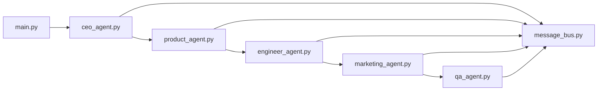

# LaunchMind ShiftSwap

A multi-agent scaffold for planning and validating a ShiftSwap product idea end-to-end.

## Idea

LaunchMind ShiftSwap is a concept workflow where specialized agents collaborate to shape strategy, product scope, engineering architecture, launch messaging, and QA readiness.

## Architecture Diagram



## Project Structure

```text
launchmind-shiftswap/
├── agents/
│   ├── ceo_agent.py
│   ├── product_agent.py
│   ├── engineer_agent.py
│   ├── marketing_agent.py
│   └── qa_agent.py
├── main.py
├── message_bus.py
├── requirements.txt
├── .env
├── .env.example
├── .gitignore
└── README.md
```

## Setup

1. Create and activate a Python virtual environment.
2. Install dependencies:
   - `pip install -r requirements.txt`
3. Copy environment template and update values:
   - `copy .env.example .env` (Windows)
4. Run the system:
   - `python main.py`

## Platform Links

- LangGraph: https://github.com/langchain-ai/langgraph
- OpenAI API: https://platform.openai.com/
- Requests: https://requests.readthedocs.io/
- LangSmith: https://smith.langchain.com/
